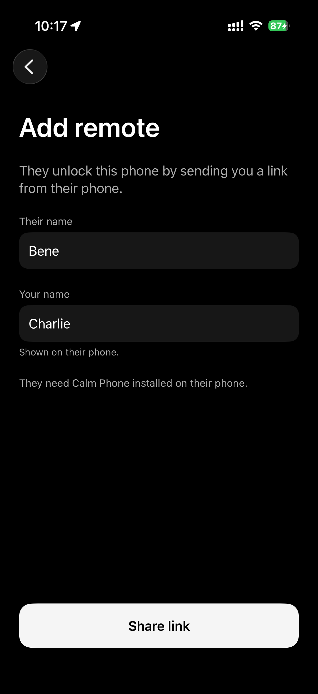
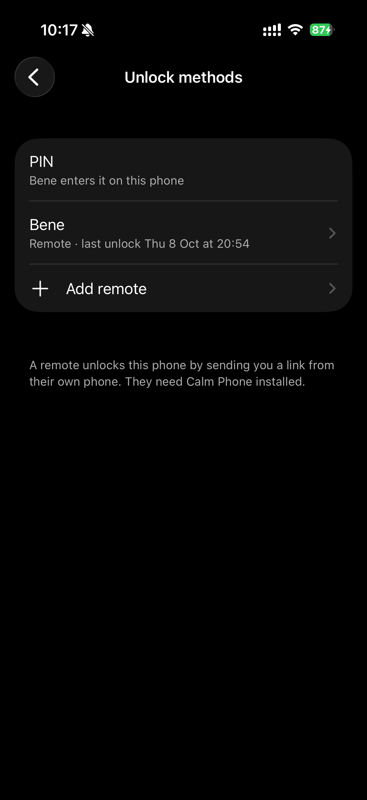
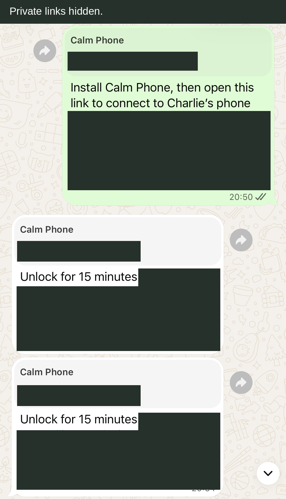

# Calm Phone — Your iPhone, without the scroll.

Every app locked except the useful ones. Someone you trust can unlock them
with a PIN, or send you a timed link from their own iPhone. Open up for 15
minutes, an hour or until midnight. Then it locks itself again.

Built on [Foqos](https://github.com/awaseem/foqos) and Apple's Screen Time
controls. Free code, [MIT licence](LICENSE). You build it yourself in Xcode.

## How it works

1. **Locked** — everything is shielded except your allowed apps and the
   remaining allowance for limited apps.
2. **Someone you trust** — they enter the PIN in person, or send an unlock
   link that you tap on the restricted phone.
3. **Timed** — 15 minutes, an hour or until midnight, then it locks again
   on its own. Temporary access applies to all apps.

**History** shows unlocks and time unlocked per day. It measures authorised
access time, rather than time spent using apps, and keeps a 30-day view.

## Keep, limit, block

The starting arrangement described on the [tool page](https://www.ellington.design/tools/calm-phone):

| Keep | Limit | Block |
| --- | --- | --- |
| Calls, messages, WhatsApp, camera, maps, music, the bank. | Photos, Maps, Weather, Files: ten minutes a day. Claude: thirty. | Browsers, mail, Instagram, LinkedIn, X, YouTube, the App Store, and everything not on your list. |

You choose your own apps during setup. Nothing is preselected: Apple gives
the app private selection tokens, so it cannot choose apps by name. There
are six default limit slots: Photos, Apple Maps, Google Maps, Weather and
Files at 10 minutes each, and Claude at 30. Maps are useful tools with a daily
allowance in this arrangement. Each slot must have a different selected
app. All other selected apps are kept; unselected apps are blocked.

Pick up to 50 apps in total. After setup, **Settings → Apps and limits →
Edit apps and limits** lets the PIN holder change selections, slot
assignments and minutes. A coding agent can change the default slots too.

## What you'll need

- **A Mac with Xcode.** The installed source was built with Xcode 26.6 and
  iOS 26.5 SDK. Public checks run on macOS CI; see the PR’s verification
  results for the actual Xcode/runtime versions. The project minimum is
  **iOS 18.5**, iPhone only.
- **An Apple Developer account:** €99 a year, listed in your local currency
  at sign-up. Family Controls and App Groups must be available to your team.
- **Your iPhone:** nothing wiped, nothing deleted.
- **Someone you trust** to set and hold the six-digit PIN. For link
  unlocking, they also need an iPhone with the same Calm Phone app installed.
  Helper-only use needs no restriction setup on their phone.

No App Store, no TestFlight: you build it onto your own phone over a cable.

## Install

1. Clone and open the project on your Mac:

   ```sh
   git clone https://github.com/charlieellington/calm-phone.git
   cd calm-phone
   open Quiet.xcodeproj
   ```

   Select the shared **Quiet** scheme. The internal project name is retained.

2. In **Signing & Capabilities**, select your own development team for all
   five targets: `Quiet`, `QuietMonitor`, `QuietShieldConfig`,
   `QuietShieldAction`, and `QuietWidget`. Change their bundle identifiers
   from `design.ellington.quiet*` to your own unique identifiers, keeping
   each extension's identifier prefixed by the app's identifier. Change test identifiers too
   if you will run the native tests. You can keep your development team
   setting locally in ignored `Config/Signing.local.xcconfig`.

3. Register your own shared **App Group**. Replace
   `group.design.ellington.quiet` in all five `.entitlements` files and
   `QuietShared/SharedContainer.swift`, and select that group on each
   target. Update the URL type identifier in `Quiet/Info.plist` and the
   Keychain services in `Quiet/PINStore.swift` and `Quiet/RemoteStores.swift`
   to your own bundle prefix.
   Keep the internal `quiet` URL scheme. Configure Family Controls for the
   app, monitor and both shield targets; the entitlements are already in
   the project. Xcode must create profiles covering these capabilities.

4. Connect the iPhone over a cable, trust the Mac, and enable Developer Mode
   when iOS requests it. Choose the phone as Xcode's destination and run
   the **Quiet** scheme. Resolve any signing/capability errors in Xcode.

5. On the phone you want to restrict, open **Calm Phone** and choose
   **Restrict this phone**. Approve Screen Time access. In **Selected apps**,
   choose individual Keep and Limit apps, rather than whole categories or
   websites. In **Daily limits**, match each of the six slots to its actual
   app in the selection. Review the allowed apps and limits.

6. Hand the phone to the PIN holder. They tick the review confirmation,
   privately enter and confirm a six-digit PIN, and tap **Activate
   restrictions**. This app PIN is separate from iOS's Screen Time code.
   App installation and removal stay restricted even during an unlock.

7. Arrange useful apps and Calm Phone on the Home Screen using normal app
   icons. Optional wallpapers are [paper](docs/wallpapers/calm-phone-paper.png)
   and [evening](docs/wallpapers/calm-phone-evening.png); save one to Photos
   and choose it in iOS Wallpaper settings. The widget extension remains
   for compatibility, but its date and launcher widgets are retired and
   show **Widget removed**. Remove an old widget and use normal icons.

### Unlock in person

Tap **Unlock**, hand over the phone for the PIN, choose **15
minutes**, **1 hour** or **Until midnight**, check the displayed end time,
and tap **Unlock** again. Midnight uses the phone's local time; that option
is unavailable within 15 minutes of midnight. Tap **Lock now** to end access
early without a PIN. Open **Settings → History** to read each day's unlock
count and time unlocked. Daily limits and History use Europe/Brussels days
in this snapshot; see `CivilTime.calendar` to change that in code.

### Unlock by message

1. Install the same app on **both iPhones**. The helper can open a connection
   link directly; they do not need to choose **Restrict this phone**, approve
   Screen Time or configure restrictions on their phone.
2. On the restricted phone, open **Settings → Unlock methods → Add remote**.
   Enter their name and your name, then **Share link** through your messaging
   app. Names are yours to choose; the screenshots below are a personal example.
3. The helper opens the connection link on their phone and sees **Connected**.
   In **Unlock others**, they select your phone and choose **15 minutes**,
   **1 hour** or **Until midnight**, then send the resulting unlock link.
4. Tap that unlock link on the **restricted phone**. The normal global access
   timer starts for all restricted apps. **Lock now** ends access early;
   installation/removal restrictions stay on. Midnight is calculated on the
   receiving phone in its local time and needs at least 15 minutes remaining.

Unlock links work **once**, and must be redeemed within **ten minutes** of
creation. That window is separate from the access duration. A helper cannot
see app usage, remotely control the device or bypass the iOS lock screen.

Connection links have different rules: they contain a **private pairing key**,
remain usable while that credential is current and should only be shared with
someone you trust. **Share link again** sends the same credentials. Remove the
remote and add them again to replace the key; removal rejects their future
unlock links. It does not end an already-active timer—use **Lock now** for that.
The helper can disconnect from **Unlock others**. Reconnecting with a newer
connection link replaces that phone’s older connection; old-format links need
a fresh connection link.

If a link opens in a browser, tap **Open in Calm Phone**. This is the existing
fallback for independent builds using your own Apple team/bundle identifiers;
keep the `quiet` URL scheme on both phones. If a messaging in-app browser does
not open the app, use its **Open in browser** action, then try the button.
Automatic Universal Links on `www.ellington.design` apply only to the app
identity listed by that domain. The browser/fallback parser contract is tested;
delivery from your messaging app and signing identity needs an on-phone check.
See [developer link setup](docs/remote-unlock.md#links-and-independent-builds)
for optional use of your own domain.

For **expired** or **already used** links, ask for a fresh unlock link.
**Unknown remote** can mean the key was removed/replaced or the link is on the
wrong phone. Open the link on the restricted phone or reconnect from Unlock
methods. If saved connections/keys cannot be read, use **Try again**; PIN access
remains independent. An active timer takes precedence over a repeated link.
Large clock changes can keep links expired until the receiving clock catches
up with its saved freshness floor; check both clocks and use the PIN meanwhile.

<p>
  
  
</p>

*One-time connection and the resulting Unlock methods/history view. These are
supplied installed-app examples; the public app uses generic PIN-holder copy.*



*An unlock, by message. Private links hidden. This is a redacted exchange,
not the helper’s duration-selection screen. [Reusable asset manifest](docs/images/remote-unlock/manifest.json).*

The public clone, project loading and unsigned compilation can be checked
without phone access. Team/profile setup, installation, Screen Time approval
and on-phone behaviour require your own Mac, account and iPhone. After
setup, check one allowed app, one blocked app, a full timed unlock with Calm
Phone closed, early locking and a daily limit on your phone. iOS can delay
Device Activity callbacks while the device is idle; verify restoration on
waking before relying on the timer.

## Optional: evening greyscale

The **Calm Phone Colour** Shortcut is generated by
[`scripts/colour_shortcuts.py`](scripts/colour_shortcuts.py). Run it from
two daily **Time of Day** automations, at **09:00** and **19:00**, using
**Run Immediately**. The app decides whether filters should be on; the
Shortcut sets Apple's Colour Filters. Select **Grayscale** in iOS settings
first.

Follow [docs/colour.md](docs/colour.md) to generate and import it for your
signed app. Run it interactively once to approve permissions, then perform
one real automation test on the phone. The generated condition/input fix
still needs that import test. The daily schedule works independently of
app unlocks. Automatic colour return after a timed unlock or early lock is
not implemented. The app's **Last checked** matching message can be stale;
check the visible display.

## Change it with a coding agent

Ask an agent to change your apps, limits or home rows. Start it with
[`AGENTS.md`](AGENTS.md), then use `make help`, `make test`,
`make test-shortcuts`, `make test-integration`, `make build`, `make build-ios`
and `make check`. Home rows are ordinary iOS icons; `Policy.quotas` holds
the default limits. There are no remote package dependencies or private
tools. Native build output and logs stay in ignored `.build/`.

## Honest limits

It's friction, not security. A full wipe from a Mac gets round it. Links
inside allowed apps still open. Screen Time authorisation can be revoked
by the phone's owner. The PIN holder is a person, not a security product.

## Privacy

Your app selections, PIN and history stay on your phone. Connection and unlock
links are shared through the messaging app you choose. Calm Phone has no account
or analytics. Verification happens on the receiving phone; static web pages
provide the browser fallback. The private link fragment is omitted from the
page’s HTTP request. Optional
Shortcuts import/sync uses Apple's own Shortcuts service.

## The story

[The story](https://www.ellington.design/emails/calm-phone) ·
[The tool page](https://www.ellington.design/tools/calm-phone)

## Credits

[Foqos](https://github.com/awaseem/foqos) by Ali Waseem, MIT. Charlie's changes
under the same licence. See [UPSTREAM.md](UPSTREAM.md) for the pinned source
and public snapshot provenance.

## Support

Shared as a working tool, no support promised. On Charlie’s phone since
4 October 2026. Charlie reports installing the remote-unlock update on his and
Bene’s phones and successfully using unlock links on **8 October 2026**. The
supplied screenshots support that report; the exact installed revision and
every historical physical acceptance check are not established.

See [release notes](CHANGELOG.md) and [developer/testing details](docs/remote-unlock.md).
